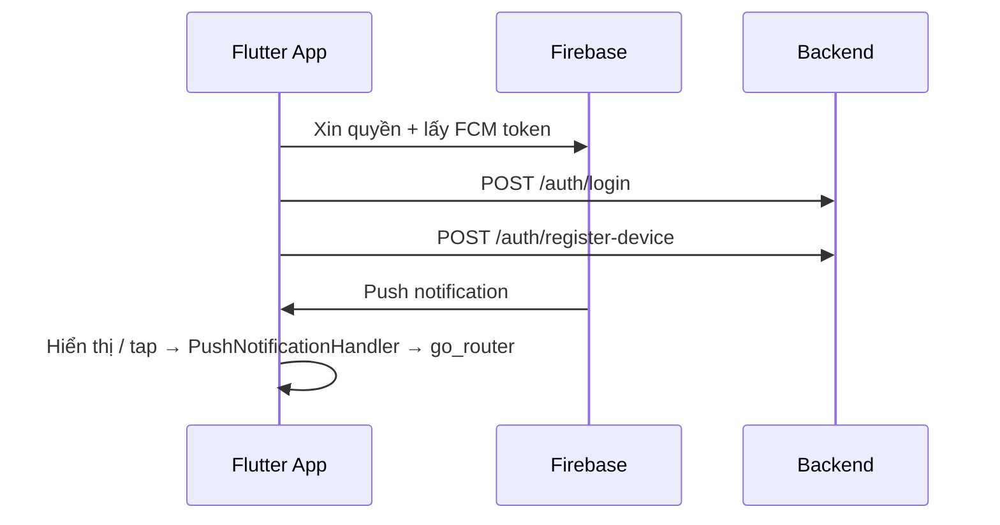

# Push Notification (FCM) — Flutter Implementation Plan

> **For agentic workers:** REQUIRED SUB-SKILL: Use superpowers:subagent-driven-development (recommended) or superpowers:executing-plans to implement this plan task-by-task.

**Goal:** Tích hợp Firebase Cloud Messaging giữa app Flutter và backend `test-y-backend`: đăng ký FCM token, nhận/hiển thị push ở mọi trạng thái app, và điều hướng theo payload `data.type`.

**Backend reference:** `/Users/huy/Documents/code/test-y-Backend/docs/PUSH_NOTIFICATION_FLUTTER.md`

**Architecture:** Mở rộng `FirebaseService` (init FCM, local notifications, tap listeners). `AuthRepository.registerDevice()` gọi `POST /auth/register-device`. `PushNotificationHandler` xử lý tenant switch + navigation; `PushNotificationListener` đồng bộ với `AuthBloc` (cold start).

**Tech Stack:** Flutter, `firebase_core`, `firebase_messaging`, `flutter_local_notifications`, `permission_handler`, `flutter_secure_storage`, `uuid`, `go_router`, `flutter_bloc`, `mocktail`.

**Trạng thái:** Phase 1–3 ✅ đã triển khai. Phase 4 (E2E với backend gửi push) ⏳ chờ backend.

---

## Tổng quan kiến trúc



---

## File map (đã tạo / sửa)

| File | Vai trò |
|------|---------|
| `lib/core/firebase/firebase_service.dart` | Init FCM, permission, foreground display, tap listeners, device registration callback |
| `lib/core/firebase/push_notification_payload.dart` | Chuẩn hóa payload (title/body từ notification hoặc data) |
| `lib/core/firebase/push_notification_types.dart` | Hằng số `type` (stock_receipt_*, invite_received, …) |
| `lib/core/firebase/push_notification_handler.dart` | Tenant switch + navigation + snackbar fallback |
| `lib/core/firebase/push_notification_listener.dart` | Wire auth lifecycle (cold start queue) |
| `lib/core/firebase/firebase_local_notification_tap.dart` | Background isolate tap handler |
| `lib/data/repositories/auth_repository_impl.dart` | `registerDevice()`, logout + deviceId |
| `lib/features/auth/bloc/auth_bloc.dart` | `registerDevice` sau auth check |
| `lib/app/app.dart` | Wire handlers + `PushNotificationListener` |
| `lib/main.dart` | Firebase init, background message handler |
| `lib/core/storage/storage_manager.dart` | `deviceId` UUID v4 (secure storage) |
| `android/app/src/main/AndroidManifest.xml` | POST_NOTIFICATIONS, default FCM channel |
| `ios/Runner/Info.plist` | UIBackgroundModes remote-notification |
| `ios/Runner/AppDelegate.swift` | registerForRemoteNotifications |
| `test/core/firebase/push_notification_payload_test.dart` | Unit tests payload |
| `test/core/firebase/push_notification_handler_test.dart` | Unit tests handler |

---

## Phase 1 — Đăng ký thiết bị ✅

**Mục tiêu:** Backend luôn có FCM token mới nhất khi user đã đăng nhập.

### Task 1.1: Nối `onTokenRefresh` với backend

**Files:**
- Modify: `lib/core/firebase/firebase_service.dart`
- Modify: `lib/app/app.dart`

- [x] Thêm `DeviceRegistrationCallback` + `setDeviceRegistrationHandler()`
- [x] `onTokenRefresh` → gọi handler → `AuthRepository.registerDevice()`
- [x] Wire handler trong `BaseApp.initState`

### Task 1.2: Gọi `register-device` khi app mở (đã login)

**Files:**
- Modify: `lib/features/auth/bloc/auth_bloc.dart`

- [x] Sau `getMe()` thành công → `_registerDeviceBestEffort()`

### Task 1.3: Gọi lại khi user cấp quyền notification

**Files:**
- Modify: `lib/core/firebase/firebase_service.dart`

- [x] `_requestPermission()` trả `bool granted`
- [x] Nếu granted → `_registerDeviceBestEffort()`

### Task 1.4: `deviceId` UUID v4

**Files:**
- Modify: `pubspec.yaml` (dependency `uuid`)
- Modify: `lib/core/storage/storage_manager.dart`

- [x] `getOrCreateDeviceId()` dùng `Uuid().v4()`

**Verify Phase 1:**
```bash
flutter test test/features/auth/auth_bloc_test.dart
# Manual: login → kiểm tra user_devices.fcm_token trong DB
# Manual: logout → status = inactive
```

---

## Phase 2 — Hiển thị notification ✅

**Mục tiêu:** App hiển thị đúng ở foreground / background / terminated.

### Task 2.1: Tap listeners (background + cold start)

**Files:**
- Modify: `lib/core/firebase/firebase_service.dart`

- [x] `FirebaseMessaging.onMessageOpenedApp`
- [x] `getInitialMessage()` tại startup
- [x] `setNotificationTapHandler()` + queue `_pendingTapData`

### Task 2.2: Local notification tap (foreground)

**Files:**
- Modify: `lib/core/firebase/firebase_service.dart`
- Create: `lib/core/firebase/firebase_local_notification_tap.dart`

- [x] `onDidReceiveNotificationResponse` → parse payload JSON → dispatch tap
- [x] `onDidReceiveBackgroundNotificationResponse` (top-level)

### Task 2.3: Cấu hình native

**Files:**
- Modify: `android/app/src/main/AndroidManifest.xml`
- Modify: `ios/Runner/Info.plist`
- Modify: `ios/Runner/AppDelegate.swift`

- [x] Android: `POST_NOTIFICATIONS`, default channel `test_y_app_channel`
- [x] iOS: `UIBackgroundModes` → `remote-notification`
- [x] iOS: `application.registerForRemoteNotifications()`
- [x] **Xcode entitlements:** `Runner.entitlements` (development) + `RunnerRelease.entitlements` (production), Push + BackgroundModes capabilities trong `project.pbxproj`
- [ ] **Manual Apple Developer / Firebase:** Bật Push Notifications trên App ID (Xcode automatic signing thường tự làm khi build)
- [ ] **Manual Firebase Console:** Upload APNs key (iOS)

### Task 2.4: Data-only foreground messages

**Files:**
- Create: `lib/core/firebase/push_notification_payload.dart`
- Modify: `lib/core/firebase/firebase_service.dart`

- [x] Fallback `data['title']` / `data['body']` khi không có `notification` block
- [x] Unit tests: `test/core/firebase/push_notification_payload_test.dart`

**Verify Phase 2:**
```bash
flutter test test/core/firebase/
# Manual: Firebase Console → Messaging → test message
#   - Foreground: local notification
#   - Background: system tray
#   - Tap: log / handler invoked
```

---

## Phase 3 — Điều hướng theo payload ✅

**Mục tiêu:** Tap notification → chuyển tenant (nếu có) → mở đúng màn hình.

### Task 3.1: PushNotificationHandler

**Files:**
- Create: `lib/core/firebase/push_notification_handler.dart`
- Create: `lib/core/firebase/push_notification_types.dart`

- [x] Parse payload → `selectTenant(tenantId)` → cập nhật `AppRouterConfig`
- [x] Điều hướng theo `type`:

| `type` | Hành vi hiện tại |
|--------|------------------|
| `stock_receipt_pending` / `stock_receipt_approved` | Home + snackbar fallback |
| `stock_issue_pending` / `stock_issue_approved` | Home + snackbar fallback |
| `invite_received` | `/select-tenant` + snackbar |
| `general` / default | Home + snackbar (nếu có title/body) |

> **Phase 3B (chưa làm):** Khi module Phiếu có route, thay snackbar bằng `router.push('/stock-receipts/:id')` / `router.push('/stock-issues/:id')`.

### Task 3.2: Cold start queue

**Files:**
- Create: `lib/core/firebase/push_notification_listener.dart`
- Modify: `lib/app/app.dart`

- [x] Queue payload khi auth chưa ready
- [x] `markAuthReady()` khi `AuthBloc` thoát `AuthLoading` / `AuthInitial`
- [x] `processPendingIfAny()` sau auth check
- [x] Dispatch `AuthTenantSelected` khi push đổi tenant

### Task 3.3: Tests

**Files:**
- Create: `test/core/firebase/push_notification_handler_test.dart`

- [x] Queue until auth ready
- [x] Defer when not logged in
- [x] `selectTenant` for stock notification
- [x] `stockDocFallbackMessage` helper

**Verify Phase 3:**
```bash
flutter test test/core/firebase/push_notification_handler_test.dart
```

Test push từ Firebase Console với custom data:
```json
{
  "type": "stock_receipt_pending",
  "tenantId": "<tenant-id>",
  "targetId": "doc-test-1",
  "title": "Phiếu nhập chờ duyệt",
  "body": "PN-TEST"
}
```

Kỳ vọng: app mở Home, snackbar hiện fallback message.

---

## Phase 4 — E2E & vận hành ⏳

**Chờ backend triển khai `firebase-admin/messaging`.**

### Task 4.1: E2E với backend gửi push thật

- [ ] Backend bật service gửi FCM
- [ ] Trigger sự kiện nghiệp vụ (phiếu chờ duyệt)
- [ ] Verify nhận push trên thiết bị thật (Android + iOS)

### Task 4.2: Module Phiếu — route chi tiết (Phase 3B)

**Files (dự kiến):**
- Modify: `lib/app/router/app_router.dart`
- Modify: `lib/core/firebase/push_notification_handler.dart`

- [ ] Thêm routes `/stock-receipts/:id`, `/stock-issues/:id`
- [ ] Cập nhật handler: navigate thay snackbar fallback

### Task 4.3: Inbox / đánh dấu đã đọc

- [ ] Chờ backend API inbox
- [ ] UI danh sách thông báo trong app (nếu cần)

---

## Khi nào gọi `register-device`?

| Sự kiện | Trạng thái |
|---------|------------|
| Login / Google login | ✅ |
| App mở lại (JWT hợp lệ) | ✅ |
| `onTokenRefresh` | ✅ |
| User cấp quyền notification | ✅ |
| Logout + `deviceId` | ✅ |

---

## Quy ước payload (backend → Flutter)

### Data payload (bắt buộc cho điều hướng)

```json
{
  "type": "stock_receipt_pending",
  "tenantId": "cuid-tenant",
  "targetId": "cuid-document",
  "title": "Phiếu nhập chờ duyệt",
  "body": "PN-2026-001 cần phê duyệt"
}
```

### Notification payload (system tray khi background)

```json
{
  "notification": { "title": "...", "body": "..." },
  "data": {
    "type": "stock_receipt_pending",
    "tenantId": "cuid-tenant",
    "targetId": "cuid-document"
  }
}
```

**Lưu ý:** Luôn đọc `data` để điều hướng. Nếu push liên quan tenant, gọi `selectTenant` trước API chi tiết (`X-Tenant-Id`).

---

## Edge cases

| Tình huống | Xử lý |
|------------|--------|
| User từ chối quyền notification | Login bình thường; `register-device` không có `fcmToken` |
| FCM token null (iOS simulator) | Bỏ qua register; test trên thiết bị thật |
| Token JWT hết hạn khi register | Dio interceptor refresh → gọi lại |
| Cold start tap notification | Queue → `markAuthReady` → `processPendingIfAny` |
| Chưa login khi tap | Queue + redirect login |
| Module Phiếu chưa có | Snackbar fallback (Phase 3A) |

---

## Troubleshooting

### Không nhận được push

1. Kiểm tra `user_devices.fcm_token` + `status = active` trong DB
2. Backend đã triển khai gửi FCM chưa? (hiện **chưa**)
3. iOS: APNs key trên Firebase Console + capabilities Xcode
4. Android: `google-services.json` đúng package name

### `register-device` trả 401

Access token hết hạn — refresh token rồi thử lại.

### Tap không điều hướng

1. Kiểm tra log `Push navigation queued until auth ready`
2. Đảm bảo `PushNotificationListener` bọc `MaterialApp.router`
3. Payload phải có `data.type`

---

## Checklist tích hợp Flutter

- [x] Cấu hình Firebase (`firebase_options.dart`, google-services)
- [x] Xin quyền notification (iOS + Android 13+)
- [x] Sinh và lưu `deviceId` cố định (Secure Storage, UUID v4)
- [x] Gọi `POST /auth/register-device` sau login
- [x] Lắng nghe `onTokenRefresh` → gọi lại register-device
- [x] Xử lý foreground notification (local notification)
- [x] Xử lý tap notification → điều hướng theo `data.type`
- [x] Gọi logout kèm `deviceId`
- [ ] Test trên thiết bị thật (Android + iOS) với push từ backend
- [ ] Route chi tiết module Phiếu (Phase 3B)

---

## Tài liệu liên quan

- Backend: `test-y-Backend/docs/PUSH_NOTIFICATION_FLUTTER.md`
- Backend API: `POST /auth/register-device`, `POST /auth/logout`
- Plan module Phiếu: `docs/superpowers/plans/2026-08-17-phieu-bao-cao.md`
